# LangGraph智能搜索代理工作流程圖

## 概述

本文檔詳細描述了基於LangGraph的智能搜索代理的完整工作流程，包括各個節點的執行順序、數據流向、決策邏輯和並行處理機制。

## 整體流程圖

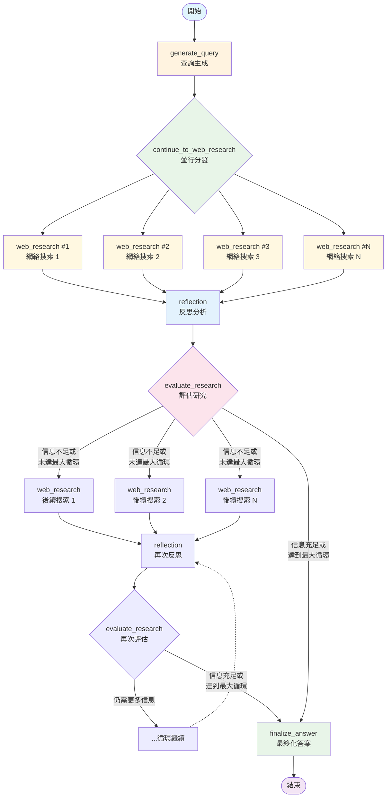

## 詳細流程說明

### 1. 初始階段 (START → generate_query)

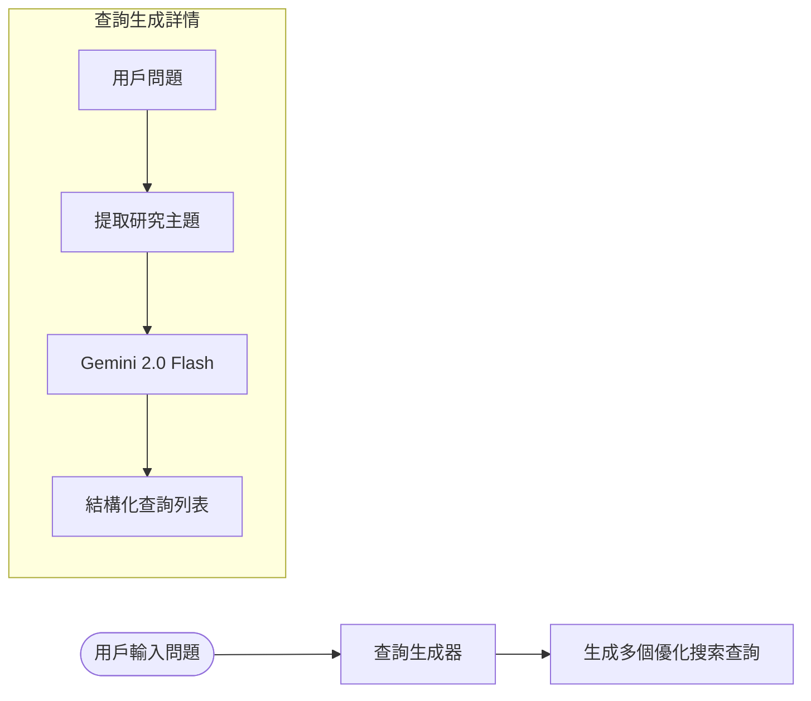

**功能說明:**
- 接收用戶的原始問題
- 使用Gemini 2.0 Flash分析並生成多個優化的搜索查詢
- 輸出結構化的查詢列表（通常3-5個查詢）

### 2. 並行搜索階段 (continue_to_web_research → web_research)

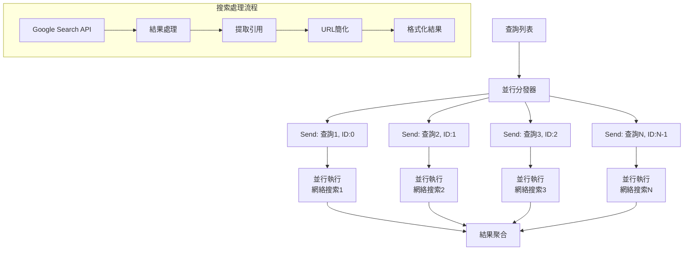

**並行處理特點:**
- 使用LangGraph的Send機制實現真正的並行執行
- 每個搜索任務分配唯一ID便於追蹤
- 所有結果最終聚合到reflection節點

### 3. 反思分析階段 (reflection)

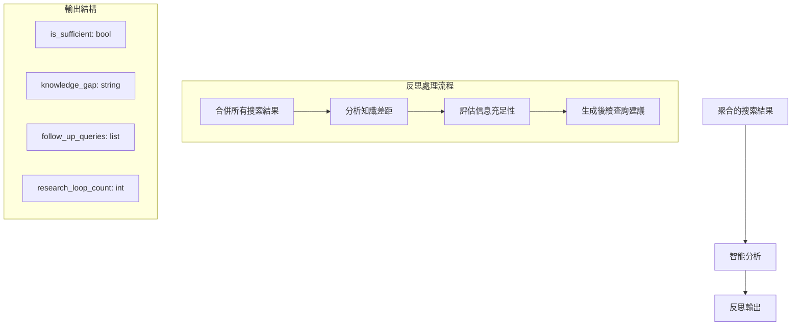

**反思邏輯:**
- 分析當前搜索結果的完整性
- 識別知識差距和信息缺失
- 生成針對性的後續搜索查詢
- 追蹤研究循環次數

### 4. 決策控制階段 (evaluate_research)

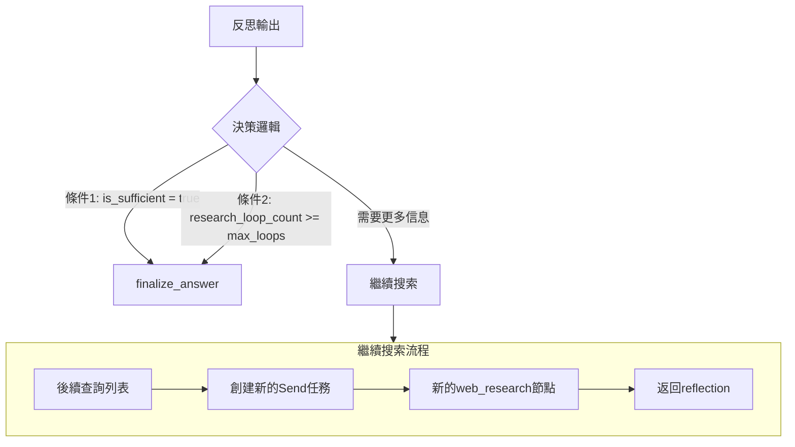

**決策規則:**
- **終止條件1**: 信息已充足 (`is_sufficient = true`)
- **終止條件2**: 達到最大循環次數 (`research_loop_count >= max_research_loops`)
- **繼續條件**: 上述條件都不滿足，則執行後續查詢

### 5. 循環機制詳解

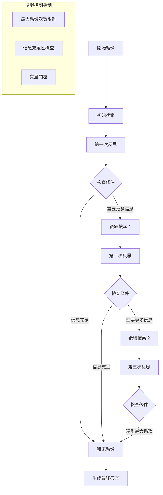

### 6. 最終化階段 (finalize_answer)

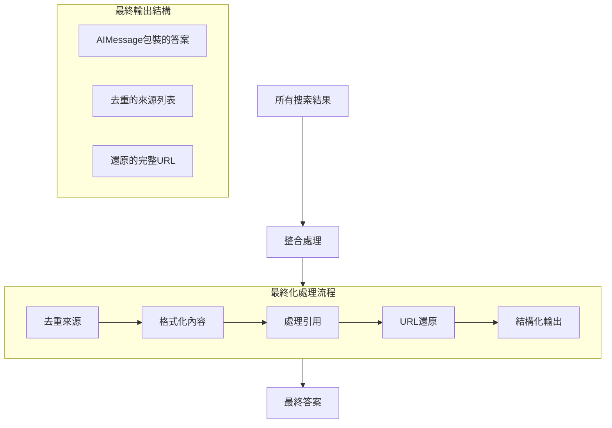

## 數據流分析

### 狀態傳遞圖

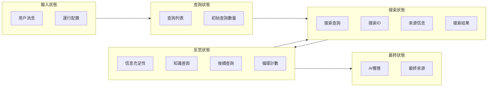

### 並行執行模式

```mermaid
gantt
    title 並行搜索執行時間線
    dateFormat X
    axisFormat %s
    
    section 查詢生成
    生成查詢列表    :0, 2
    
    section 並行搜索
    搜索任務1       :2, 5
    搜索任務2       :2, 4  
    搜索任務3       :2, 6
    搜索任務N       :2, 5
    
    section 結果聚合
    聚合所有結果    :6, 7
    
    section 反思分析
    分析和決策      :7, 9
    
    section 後續搜索(如需要)
    後續搜索1       :9, 11
    後續搜索2       :9, 10
    
    section 最終化
    生成最終答案    :11, 13
```

## 關鍵設計模式

### 1. Fan-out/Fan-in 模式

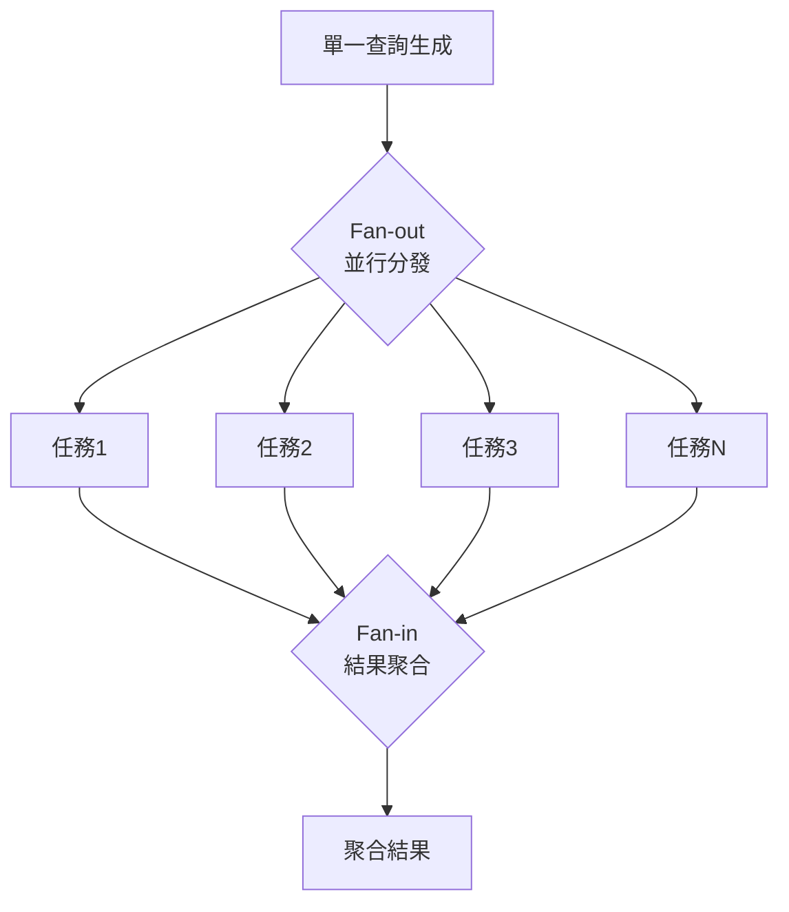

### 2. 條件循環模式

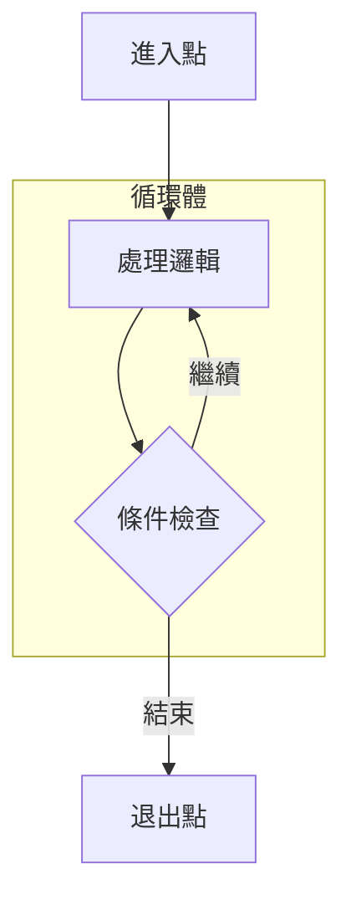

### 3. 狀態累積模式

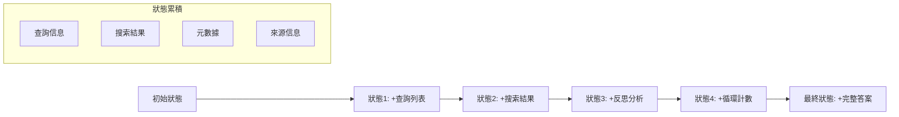

## 性能優化要點

### 1. 並行處理優化
- **同時執行**: 多個搜索查詢並行執行，而非順序執行
- **資源利用**: 最大化API調用效率
- **時間節省**: 總執行時間約等於最慢搜索任務的時間

### 2. Token優化策略
- **URL簡化**: 將長URL替換為短標識符以節省token
- **結果去重**: 避免重複處理相同的信息源
- **漸進式處理**: 根據需要逐步加載更多信息

### 3. 循環控制優化
- **智能終止**: 基於信息質量而非固定次數決定是否繼續
- **差距分析**: 精確識別需要補充的信息類型
- **避免冗餘**: 防止重複搜索已獲得的信息

## 錯誤處理和容錯機制

### 1. API調用容錯

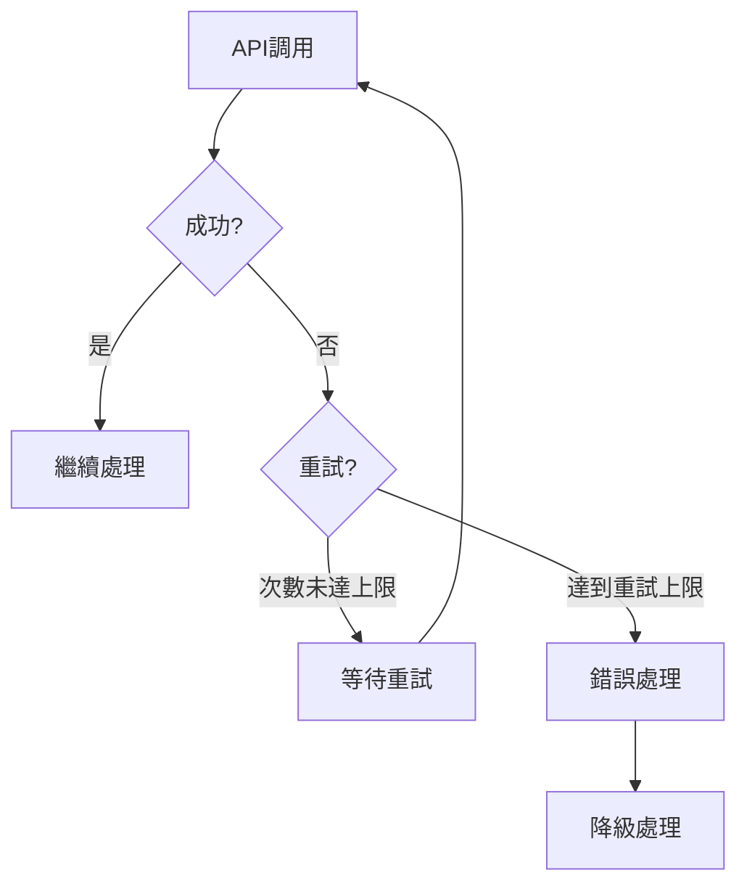

### 2. 狀態恢復機制
- **檢查點**: 在關鍵節點保存狀態
- **回滾**: 出錯時回到最近的有效狀態
- **部分結果**: 即使部分失敗也能利用已獲得的結果

## 擴展性設計

### 1. 新節點添加
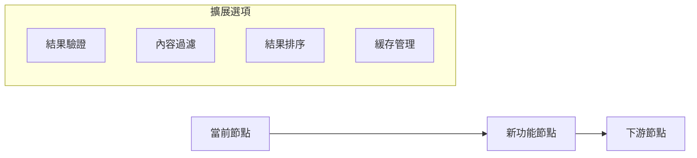

### 2. 配置靈活性
- **運行時調整**: 支持動態修改參數
- **模型切換**: 可選擇不同的語言模型
- **策略選擇**: 支持不同的搜索和處理策略

這個工作流程圖展示了一個sophisticated的智能搜索代理系統，它結合了並行處理、智能決策、循環優化等多種先進的設計模式，為用戶提供高質量的研究和信息聚合服務。